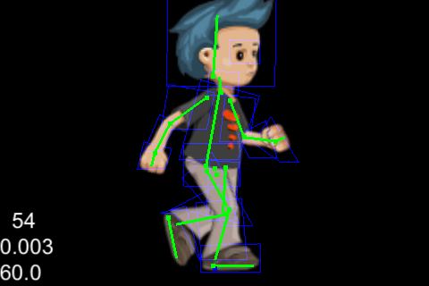

Debug drawing for Spine cocos2dx runtime
========================

### Introduction

`CCSpineDebugDrawNode` is a `cocos2d::CCNode` subclass which does debug drawing for `spine::CCSkeleton`

### Usage

	  // Create and add skeletons to CCLayer as normal
	  CSkeleton* skeletonNode1 = new CCSkeleton(skeletonData);
	  CSkeleton* skeletonNode2 = new CCSkeleton(skeletonData);
	  addChild(skeletonNode1);
	  addChild(skeletonNode2);
	  
	  // Create and add debug draw node to layer
	  CCSpineDebugDrawNode* debugDrawNode = CCSpineDebugDrawNode::create();
	  debugDrawNode->setPosition(CCPointZero);
	  addChild(debugDrawNode, 1000);
	  
	  // Register skeletons with our debug draw node
	  debugDrawNode->getSkeletons()->addObject(skeletonNode1);
	  debugDrawNode->getSkeletons()->addObject(skeletonNode2);
	  
	  // Enable/disable drawing slot bounding boxes or bones if you wish
	  debugDrawNode->setIsDrawingBones(false);             // true by default
  	  debugDrawNode->setIsDrawingSlotBoundingBoxes(false); // true by default

### License

Copyright (c) 2013 Vinova Pte Ltd

http://www.vinova.sg

Permission is hereby granted, free of charge, to any person obtaining a copy
of this software and associated documentation files (the "Software"), to deal
in the Software without restriction, including without limitation the rights
to use, copy, modify, merge, publish, distribute, sublicense, and/or sell
copies of the Software, and to permit persons to whom the Software is
furnished to do so, subject to the following conditions:

The above copyright notice and this permission notice shall be included in
all copies or substantial portions of the Software.

THE SOFTWARE IS PROVIDED "AS IS", WITHOUT WARRANTY OF ANY KIND, EXPRESS OR
IMPLIED, INCLUDING BUT NOT LIMITED TO THE WARRANTIES OF MERCHANTABILITY,
FITNESS FOR A PARTICULAR PURPOSE AND NONINFRINGEMENT. IN NO EVENT SHALL THE
AUTHORS OR COPYRIGHT HOLDERS BE LIABLE FOR ANY CLAIM, DAMAGES OR OTHER
LIABILITY, WHETHER IN AN ACTION OF CONTRACT, TORT OR OTHERWISE, ARISING FROM,
OUT OF OR IN CONNECTION WITH THE SOFTWARE OR THE USE OR OTHER DEALINGS IN
THE SOFTWARE.
